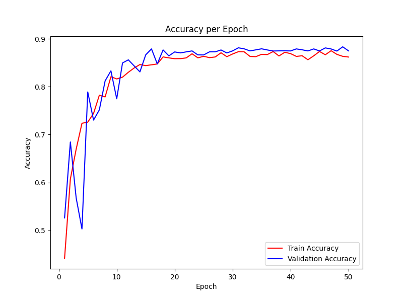

# CNN Project 

This project was submitted as an assignment for HON AI COMPUTER VISION.  

I structured this code in a way that it can be adapted for other datasets and custom models with minimal changes.  

In this project, I experimented with the different kernel sizes in the first convolutional layer. My goal was to explore the effect of three different kernel sizes (3x3, 5x5, 7x7) in the first convulutional layer on image classification.  
The image classification task I explored was classifying Formula One cars, belonging to six teams.  

Due to the large size of the ResNet50 transfer learning model, I was not able to include a saved version of the model in my GitHub repository. 

I have also included a file for testing saved models, `load_model.py`. 

## The Dataset 

The dataset I used can be found [here](https://www.kaggle.com/datasets/vesuvius13/formula-one-cars).

I modified the linked dataset above in four ways: 
- Remove the 2 classes with significantly less data, leaving six classes (included in code)
- Tested if each image could be converted to a PyTorch tensor (included in code) 
- Included only images that had `.jpg` format, since some other formats would frequently cause errors (included in code)

The above inclusion criteria are applied in the preprocessing function in my code (only applied if `-p True` is included in command line arguments). 

I also manually checked every image for quality, removing images that were difficult for me (a human) to classify, ensuring the quality of the data. 

## The Models 

Along with my three custom models, I included a transfer learning model, using weights and architecture from ResNet50. This was used to gauge the performance of my models. 

4 models have been included in this project: 
- `Cv1`: custom model. 
    - Kernel size in first convolutional layer: 3x3  
    - Image size: 256x256
- `Cv2`: custom model. 
    - Image size: 256x256  
    - Kernel size in first convolutional layer: 5x5
- `Cv3`: custom model. 
    - Image size: 256x256  
    - Kernel size in first convolutional layer: 7x7
- `res`: derived from pre-trained model [ResNet50](https://pytorch.org/vision/main/models/generated/torchvision.models.resnet50.html). All weights were imported, and only the final layer was fine-tuned in this code. 
    - Image size: 224x224
 
Learning rate scheduler 
- I wrote my own learning rate scheduler. It works on exponential decay with a customizable decay rate.

Data augmentation 
- I used data augmentation on my training set, as I struggled with overfitting. 

## Model architecture and calculations 

Model architecture can be found in `/models`.  
Weights imported from ResNet50 can be found [here](https://pytorch.org/vision/main/models/generated/torchvision.models.resnet50.html). 

## Notes on model architecture 

**Image size**
- For my custom models, I chose to use image size 256. 
- For ResNet50, I chose to use image size 224, since the original model was trained using this image size.  

**Kernel sizes**  
I experimented with different kernel sizes in the first convolution. All subsequent layers were minimally adjusted to account for the difference of the first convolutional layer. 
- Cv1: 3x3
- Cv2: 5x5
- Cv3: 7x7 

## Training Procedure 

Each model was trained for 50 epochs. For each model, this was sufficient to achieve a plateau in both loss and accuracy.  
All models were trained using a learning rate scheduler. The scheduler used can be found in `/utils/learning_rate_schedulers.py`. 

## Command Line Arguments 

This code takes three arguments in the command line: 
- -d (str): path to the dataset directory. 
- -e (int): total number of epochs. 
- -m (str): model name. Must be one of the following: `Cv1`, `Cv2`, `Cv3`, `res`. 
- -p (bool): whether to preprocess the dataset, as described above. Defaults to `False`. 

## Results 

Below are graphs of training loss, validation loss, training accuracy, and validation accuracy over the 50 epochs. 

### Cv1 
<table>
  <tr>
    <td></td>
    <td></td>
  </tr>
</table>

### Cv2
<table>
  <tr>
    <td></td>
    <td></td>
  </tr>
</table>

### Cv3 
<table>
  <tr>
    <td></td>
    <td></td>
  </tr>
</table>

### ResNet50 

<table>
  <tr>
    <td></td>
    <td></td>
  </tr>
</table>

## Analysis 

The highest validation accuracy from each model is as follows: 
- Cv1: 0.8895 (Epoch 35) 
- Cv2: 0.8833 (Epoch 49) 
- Cv3: 0.8706 (Epoch 33) 
- ResNet50: 0.8914 (Epoch 32)

Ultimately, the three models achieved similar maximum validation accuracies, although that of Cv3 was slightly lower. It is difficult to determine whether there is a difference in performance between the three models. 
